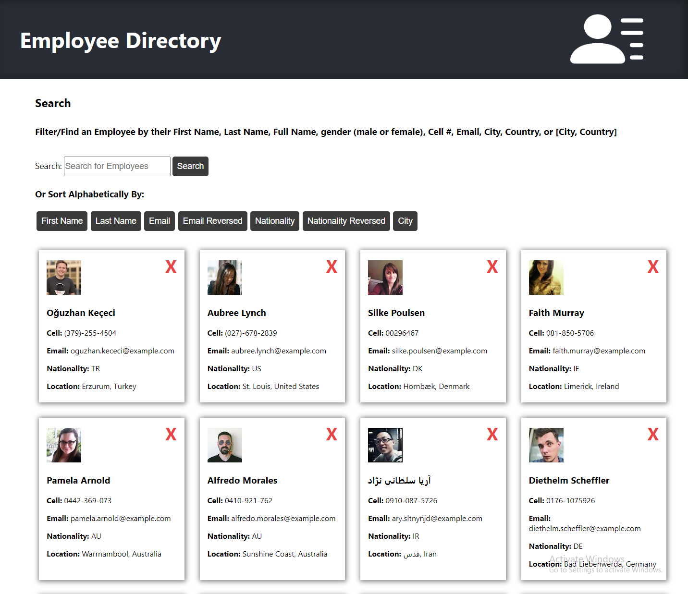

# employee-directory  
 

Employee Directory built with React and the Random User Generator API

## Description  
This App was built with React.js, and it returns a list of 'employees' from the Random User Generator API. A search bar allows the user to filter employees by a number of parameter, such as name, email, and city.  Dedicated buttons allow the user to sort employees alphabetically by various parameters as well.

## Table of Contents  
-[User Story](#user-story)  
-[Business Context](#business-context)  
-[Acceptance Criteria](#acceptance-criteria)  
-[Usage](#usage)  
-[License](#license)  
-[Questions](#questions) 

## User Story
* As a user, I want to be able to view my entire employee directory at once so that I have quick access to their information.

## Business Context
An employee or manager would benefit greatly from being able to view non-sensitive data about other employees. It would be particularly helpful to be able to filter employees by name.

## Acceptance Criteria
Given a table of random users generated from the [Random User API](https://randomuser.me/), when the user loads the page, a table of employees should render. 

The user should be able to:

  * Sort the table by at least one category

  * Filter the users by at least one property.  

## Usage  
  
[Deployed App](deployed-app-link)  

## Technology  
- [React.js](https://reactjs.org/)
- [Node.js](https://nodejs.org/en/)
- [Node Package Manager](https://www.npmjs.com/)  
- [Axios](https://www.npmjs.com/package/axios)  
- [Random User Generator API](https://randomuser.me/)  

## License  
View the full MIT License [here](./LICENSE)  
